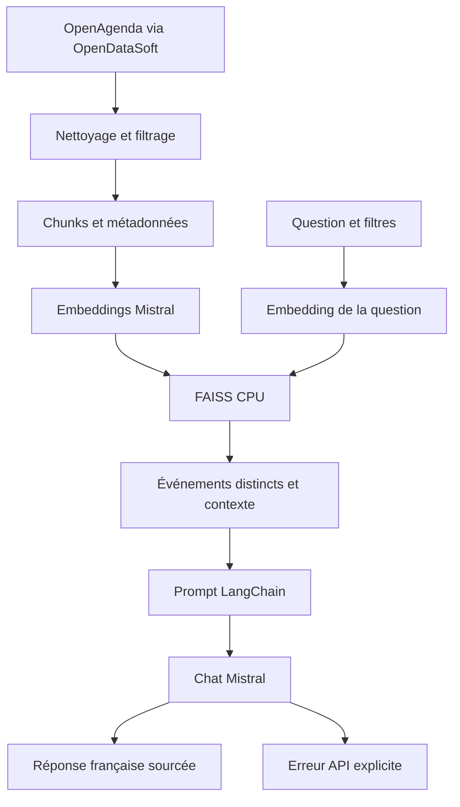

# Puls-Events RAG

POC OpenClassrooms de recommandation d’événements culturels en **Pays de la Loire**.
Python et Pandas préparent les données OpenAgenda ; **mistral-embed**, **FAISS CPU**
et **LangChain + Chat Mistral** assurent recherche et génération en français.

La génération est actuellement bloquée par un **HTTP 429 Mistral, code 1300**,
reproduit avec un appel HTTP direct minimal. Un résultat de retrieval réussi
ne constitue pas une génération réussie. Les preuves disponibles sont dans
`reports/evidence/` et l’état de conformité dans `docs/CONFORMITE.md`.

## Architecture



L’historique conversationnel n’est pas nécessaire dans la mission et n’est pas ajouté.
Le retrieval réutilise `src/rag/retrieval.py` ; le pipeline ne le duplique pas.

## Prérequis et installation

Utiliser Python 3.12, Git et une clé API Mistral autorisée. Docker Desktop avec
conteneurs Linux est la voie recommandée sur Windows. Le conteneur contient un venv.
Le moteur Docker n’est pas disponible dans l’environnement Work de cet audit :
les commandes Docker doivent encore être exécutées sur une machine qui en dispose.

Depuis PowerShell :

```powershell
git clone https://github.com/Hassna-elbousiydy/Puls_Events_RAG.git
cd Puls_Events_RAG
git switch fix/complete-rag-poc
Copy-Item .env.example .env
# Renseigner la clé dans .env avec votre éditeur, sans la publier.
docker compose build
docker compose run --rm rag
docker compose run --rm rag python -m pip check
```

La branche doit d’abord être publiée : l’audit Work a rencontré un accès GitHub 404.
Alternative sans Docker :

```powershell
py -3.12 -m venv .venv
.\.venv\Scripts\Activate.ps1
python -m pip install -r requirements.txt
python -m pip check
python scripts/check_environment.py
```

## Configuration

| Variable | Usage | Défaut |
|---|---|---|
| `MISTRAL_API_KEY` | Secret local obligatoire pour les appels API | Aucun |
| `MISTRAL_CHAT_MODEL` | Modèle de génération et d’évaluation | `mistral-small-2603` |
| `PULS_REFERENCE_DATE` | Rejouer explicitement une date, YYYY-MM-DD | Date actuelle Europe/Paris |
| `SSL_CERT_FILE` / `SSL_CERT_DIR` | Certificats de confiance, si un proxy TLS l’exige | Configuration HTTPX |

Le modèle `mistral-small-2603` a été trouvé dans la liste réelle du compte lors
du diagnostic du 14 septembre 2026. Sa présence ne garantit pas du quota chat.
Le modèle d’embedding reste **mistral-embed, dimension 1024**. Il n’est pas interchangeable
avec un autre modèle sans nouvelle vectorisation. Aucune vérification TLS n’est désactivée.
Avec un proxy SOCKS, installer `httpx[socks]` dans l’environnement concerné.

## Dépendances et structure

`requirements.txt` conserve les versions existantes de LangChain, Community,
Mistral SDK, intégration Mistral et FAISS. `requirements-lock.txt`, lorsqu’il est
présent, décrit l’environnement complet réellement résolu pendant l’audit.

| Chemin | Fonction |
|---|---|
| `scripts/fetch_openagenda.py` | Export OpenAgenda par API Explore v2.1 OpenDataSoft |
| `scripts/preprocess_openagenda.py` | Nettoyage, région, créneaux, statut et culture |
| `scripts/build_chunks.py` | Découpage récursif LangChain |
| `scripts/build_vectorstore.py` | Embeddings et construction FAISS avec sauvegarde |
| `scripts/rebuild_pipeline.py` | Reconstruction isolée puis tests et activation |
| `scripts/refresh_snapshot.py` | Retrait des événements expirés sans nouveaux embeddings |
| `src/rag/retrieval.py` | Filtrage, recherche, déduplication et contexte |
| `src/rag/pipeline.py` | Prompt LangChain et génération Mistral |
| `src/rag/config.py`, `errors.py` | Configuration et erreurs explicites |
| `src/rag/evaluation.py` | Grille de jugement sémantique Mistral |
| `scripts/demo.py` | Démo terminal avec sources affichées avant le chat |
| `scripts/evaluate_rag.py` | Évaluation réelle et checkpoints JSON |
| `tests/` | Unités offline et contrôles des fichiers de données |
| `data/raw/`, `data/processed/`, `vectorstore/` | Artefacts locaux reconstruisibles, ignorés par Git |
| `data/evaluation/` | 25 questions et références vérifiables |
| `reports/generated/` | Sorties de l’exécution courante |
| `reports/evidence/` | Preuves datées sélectionnées pour versionnement |
| `docs/` | Audit, conformité, rapport et soutenance |

Les scripts `inspect_*`, `profile_*`, `review_cultural_filter.py` et
`compare_openagenda_snapshots.py` restent des outils d’audit. Les anciens
`test_rag_retrieval.py` et `test_vectorstore_search.py` sont des smoke tests historiques ;
utiliser le module réutilisable pour la démo et l’évaluation actuelles.

## Acquisition OpenAgenda

Source : [Événements publics OpenAgenda](https://public.opendatasoft.com/explore/dataset/evenements-publics-openagenda/).
L’API utilisée est celle de l’export public OpenDataSoft ; ce n’est pas l’API
privée d’administration des agendas. Le périmètre est Pays de la Loire.

```powershell
docker compose run --rm rag python scripts/fetch_openagenda.py --reference-date 2026-09-15
```

L’export est filtré par région et dernière fin d’événement. Le nettoyage contrôle
ensuite les créneaux réels, et pas seulement les bornes globales.
Une source en ligne évolue : même date de référence ne signifie pas mêmes octets.
Pour rejouer exactement un corpus, conserver le CSV brut et son empreinte SHA-256.
L’écart historique entre comptage API (25 348) et export (24 601) n’a pas été expliqué
par une nouvelle acquisition durant cet audit ; ne pas garantir l’exhaustivité de la plateforme.

## Pré-processing et dates

```powershell
docker compose run --rm rag python scripts/preprocess_openagenda.py --reference-date 2026-09-15
```

La mission combine « événements récents de moins d’un an » et « 1 an d’historique
et événements à venir ». Règle retenue : conserver les occurrences dont la fin est
supérieure ou égale à la date de référence moins une année calendaire, avec début
inférieur ou égal à la fin. Les événements futurs n’ont pas de borne supérieure
arbitraire. Une occurrence qui traverse la borne est conservée.

Les événements annulés sont exclus ; un filtre lexical sélectionne le périmètre
culturel, avec exclusions d’agendas non culturels. Il peut produire des faux positifs
ou négatifs et nécessite une revue. Les titres et descriptions vides sont rejetés.
Les UID sont dédupliqués. Les données de lieu disponibles sont concaténées sans
inventer de ville. Dans le snapshot initial, 92 villes manquent mais disposent de
coordonnées. Un filtre de ville ne peut pas retrouver ces événements sans enrichissement.

Les descriptions et `date_range` sont des textes d’origine et peuvent mentionner
des dates historiques. Les créneaux admissibles structurés font autorité.

## Chunking et indexation

```powershell
docker compose run --rm rag python scripts/build_chunks.py
docker compose run --rm rag python scripts/build_vectorstore.py
```

`RecursiveCharacterTextSplitter` utilise **1 500 caractères**, un chevauchement
maximal de **200 caractères** et des séparateurs de paragraphes/phrases.
Chaque chunk conserve UID, ordre, titre, dates, ville, région, lieu et URL.
Le rapport compare la couverture des UID et le nombre de chunks.

L’index reste **IndexFlatL2** : recherche exacte, adéquate pour ce volume.
Les scores FAISS sont des **distances L2 au carré**, pas des probabilités.
Les fichiers `index.faiss` et `index.pkl` sont sauvegardés puis rechargés.
Ne charger que des fichiers pickle de confiance produits ou fournis pour ce projet.
La construction prépare un nouvel index avant de remplacer l’ancien ; une sauvegarde
`.previous-*` reste disponible. Un échec d’embedding conserve l’index actif.

## Reconstruction complète

```powershell
docker compose run --rm rag python -m scripts.rebuild_pipeline --reference-date 2026-09-15
```

Cette commande enchaîne acquisition, pré-processing, chunks, embeddings, FAISS,
`pytest`, puis active les sorties. Les fichiers actifs restent en place en cas
d’échec avant activation. Arrêter la démo pendant la maintenance ; l’activation
n’est pas une transaction multi-processus destinée à la production.
Pour repartir du CSV déjà acquis : ajouter `--from-snapshot`.
Cette option ne récupère aucun nouvel événement ; elle recalcule les embeddings.

Pour actualiser uniquement les dates, sans coût d’embedding et sans modifier la source :

```powershell
docker compose run --rm rag python -m scripts.refresh_snapshot --output refreshed_snapshot --reference-date 2026-09-15
```

Le dossier de destination doit être nouveau. Les textes inchangés réutilisent exactement
leurs anciens vecteurs ; l’association chunk/vecteur/métadonnées est contrôlée.
On peut tester la copie avec `--index refreshed_snapshot/vectorstore/faiss_index` dans la démo.
Les anciens rapports restent des preuves historiques ; ne pas les lire comme des résultats actualisés.

## Retrieval, génération et démo

```powershell
docker compose run --rm rag python -m scripts.demo "Où voir Plants and People à Nantes ?" --city Nantes
docker compose run --rm rag python -m scripts.demo "Quand rencontrer Abigail Assor ?" --city Angers --start-date 2026-09-15 --end-date 2026-09-15
docker compose run --rm rag python -m scripts.demo "Quel concert propose Comme un air de jazz ?" --city Nantes
docker compose run --rm rag python -m scripts.demo "Quels concerts à Paris ?" --city Paris
```

Les filtres ville et période sont explicites : le POC n’extrait pas automatiquement
toutes les contraintes d’une question libre. La date de fin passée en option est inclusive.
Le retrieval exclut les événements périmés et regroupe les chunks par UID.
Le prompt impose le français et l’utilisation exclusive des sources. Il demande de
signaler une absence d’information et de ne pas inventer titre, date, lieu ou URL.
Ces instructions réduisent le risque d’hallucination mais ne prouvent pas l’exactitude.

## Diagnostic Mistral et erreurs

```powershell
docker compose run --rm rag python -m scripts.check_mistral_rate_limit
docker compose run --rm rag python -m scripts.test_mistral_minimal
docker compose run --rm rag python -m scripts.test_rag_pipeline
```

Le diagnostic direct réalise une lecture des modèles puis un seul petit appel chat.
Le test minimal LangChain n’utilise ni FAISS ni contexte documentaire.
Les erreurs 401/403, 429, timeout, réseau et réponse vide sont explicites.
Les erreurs de programmation non reconnues restent des erreurs. Aucun retry
agressif, aucune réponse factice utilisée pour remplacer un échec API.

Un HTTP 429 direct sur un modèle accessible situe le refus côté fournisseur,
indépendamment de FAISS/LangChain. Il ne précise pas lequel des plafonds du workspace
est atteint. Vérifier usage et limites du compte Mistral ; aucune action payante
ni changement de plan n’a été effectué. Le diagnostic enregistre statut et code,
jamais la clé. Consulter la [documentation Mistral](https://docs.mistral.ai/).

## Tests offline

```powershell
docker compose run --rm rag python -m pytest -q
docker compose run --rm rag python -m pytest -q -m artifacts
docker compose run --rm rag python -m pytest -q tests/test_rag_offline.py
```

`pytest.ini` limite la découverte à `tests/`. Les connexions réseau y sont interdites.
Les mocks sont explicitement des tests unitaires, jamais des générations réelles.
Sans dataset local, les contrôles d’artefacts sont **ignorés**, pas réussis :
reconstruire puis exécuter `pytest -m artifacts` pour valider les données.
Le contrôle de fraîcheur utilise la date du jour, sauf rejeu historique explicite
avec `PULS_REFERENCE_DATE`. Les nombres d’événements ne sont plus figés sur un ancien export.

## Évaluation

```powershell
docker compose run --rm rag python -m scripts.evaluate_rag
docker compose run --rm rag python -m scripts.evaluate_rag --generate --judge --output reports/generated/rag_generation_evaluation.json
```

La première commande évalue la récupération d’UID (précision, rappel, rang réciproque).
Elle nécessite Mistral pour les embeddings des questions. Les cas hors périmètre
et ambiguës sont traités séparément. Les questions sont ciblées : ces scores
ne prouvent pas la qualité sur toutes les demandes ouvertes.

La seconde ajoute la génération puis une grille sémantique explicite : fidélité,
pertinence de réponse, précision et rappel du contexte. Cette alternative légère
reprend les axes du cours et borne le coût à un appel de jugement par réponse.
Elle **n’est pas une exécution de Ragas**, ni une prétendue reproduction exacte de ses métriques.
Ragas n’est pas déclaré incompatible : ce choix limite les dépendances et les appels
supplémentaires dans un compte déjà soumis à un blocage chat. Un jugement Mistral
reste imparfait ; une revue humaine est nécessaire.

Les 25 références sont extraites des données vérifiées, jamais des sorties du modèle.
Le champ `human_reviewed=false` indique que leur validation humaine reste à faire.
Les résultats sont enregistrés après chaque cas. Sur 429, le script s’arrête avec
un code de sortie non nul et conserve les cas exécutés. Aucune moyenne ne doit
être présentée sans vérifier le nombre de cas terminés et le statut du rapport.

## Limites et production

Le POC ne gère ni mémoire conversationnelle, ni concurrence de reconstruction,
ni extraction automatique robuste des filtres, ni validation déterministe complète
des affirmations du LLM. Il dépend du quota et de la disponibilité Mistral.
Le snapshot ne reflète pas les ajouts ou annulations intervenus après acquisition.

Pour une version de production : planifier acquisition et validation de fraîcheur,
versionner les snapshots et modèles, protéger les clés dans un gestionnaire de secrets,
prévoir supervision des erreurs/latences/coûts, revue régulière des annotations,
tests de non-régression et suivi du feedback. Mettre en place une activation
atomique par versions et une politique de sauvegarde. Comparer d’autres index
FAISS seulement si le volume ou la latence le justifie.

## Livrables et sources

La mission exige également un rapport **5 à 10 pages**, une présentation
**10 à 15 diapositives**, une démo et un ZIP avec la convention de nommage demandée.
Les éléments techniques sont documentés dans `docs/` ; un document Markdown seul
ne constitue pas un rapport Word/PDF ou un PowerPoint final.

Autorité : Mission.docx, version jointe Mission(7), identique à Mission(6).
Référence complémentaire : Cours_Mettez en place un RAG pour un LLM.docx,
lu intégralement ; ses anciens exemples SDK ne sont pas recopiés tels quels.
Documentation technique : [LangChain](https://docs.langchain.com/),
[FAISS](https://github.com/facebookresearch/faiss), [Mistral](https://docs.mistral.ai/).

Autrice du projet : Hassna EL-BOUSIYDY.
