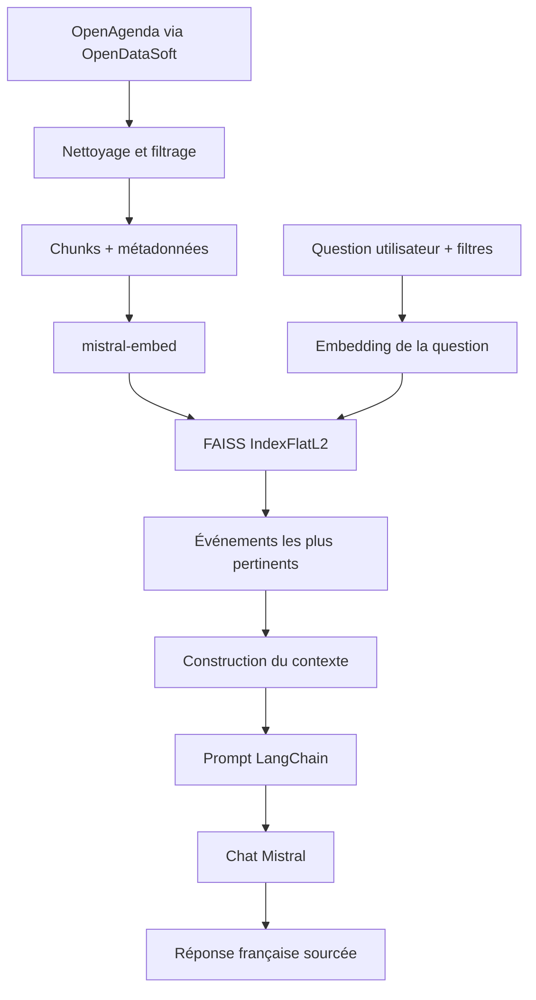

# Puls-Events RAG

POC de recommandation d’événements culturels développé dans le cadre de la formation OpenClassrooms Data Engineer.

Le système utilise les données publiques OpenAgenda sur le périmètre **Pays de la Loire** et met en œuvre une architecture **RAG (Retrieval-Augmented Generation)** avec :

- Python / Pandas pour l’acquisition et le prétraitement ;
- LangChain pour l’orchestration ;
- `mistral-embed` pour les embeddings ;
- FAISS CPU pour la recherche vectorielle ;
- un modèle de chat Mistral pour générer les réponses ;
- un jeu d’évaluation de 25 questions-réponses validées humainement.

Le POC est fonctionnel de bout en bout : acquisition, prétraitement, vectorisation, retrieval, génération, évaluation et tests automatisés.

---

## Architecture



Le système ne conserve pas d’historique conversationnel, conformément au périmètre du POC.

---

## Prérequis

Environnement recommandé :

- Python 3.12 ;
- Docker Desktop ;
- Git ;
- clé API Mistral valide ;
- conteneurs Linux sous Docker Desktop.

Créer le fichier `.env` à partir de `.env.example` :

```powershell
Copy-Item .env.example .env
```

Puis renseigner localement :

```text
MISTRAL_API_KEY=...
MISTRAL_CHAT_MODEL=ministral-8b-2512
```

La clé API ne doit jamais être versionnée dans Git.

---

## Installation avec Docker

```powershell
git clone https://github.com/Hassna-elbousiydy/Puls_Events_RAG.git
cd Puls_Events_RAG
git switch fix/complete-rag-poc

Copy-Item .env.example .env

docker compose build
docker compose run --rm rag python -m pip check
```

Pour vérifier l’environnement :

```powershell
docker compose run --rm rag python scripts/check_environment.py
```

---

## Configuration

| Variable | Rôle | Valeur utilisée |
|---|---|---|
| `MISTRAL_API_KEY` | Authentification Mistral | Secret local |
| `MISTRAL_CHAT_MODEL` | Modèle de génération | `ministral-8b-2512` |
| `PULS_REFERENCE_DATE` | Date de référence des contrôles temporels | Date courante ou valeur explicite |
| `SSL_CERT_FILE` / `SSL_CERT_DIR` | Certificats TLS si nécessaire | Configuration système |

Le modèle utilisé pour les embeddings est :

```text
mistral-embed
```

Dimension des embeddings :

```text
1024
```

Le modèle d’embedding ne doit pas être changé sans reconstruire le vectorstore.

---

## Structure principale du projet

| Chemin | Fonction |
|---|---|
| `scripts/fetch_openagenda.py` | Acquisition des événements |
| `scripts/preprocess_openagenda.py` | Nettoyage et filtrage |
| `scripts/build_chunks.py` | Construction des chunks |
| `scripts/build_vectorstore.py` | Embeddings et index FAISS |
| `scripts/rebuild_pipeline.py` | Reconstruction complète |
| `scripts/refresh_snapshot.py` | Rafraîchissement temporel |
| `scripts/demo.py` | Démonstration du chatbot |
| `scripts/evaluate_rag.py` | Évaluation du RAG |
| `scripts/review_rag_evaluation.py` | Validation humaine du jeu de référence |
| `src/rag/retrieval.py` | Retrieval FAISS et filtres |
| `src/rag/pipeline.py` | Pipeline RAG et génération |
| `src/rag/config.py` | Configuration du modèle de chat |
| `src/rag/evaluation.py` | Jugement sémantique |
| `data/evaluation/` | Jeu de 25 questions-réponses |
| `tests/` | Tests automatisés |
| `reports/generated/` | Rapports générés |
| `docs/` | Documentation technique et soutenance |

---

## Source des données

Le projet exploite le dataset public :

**Événements publics OpenAgenda**

Source publique :

https://public.opendatasoft.com/explore/dataset/evenements-publics-openagenda/

L’acquisition automatisée utilise l’API publique du dataset OpenAgenda exposée via OpenDataSoft Explore API v2.1.

Il s’agit de l’API publique du dataset et non de l’API privée d’administration des agendas OpenAgenda.

Le périmètre géographique retenu pour le POC est :

```text
Pays de la Loire
```

Le jeu de données initial étudié contenait :

```text
24 601 lignes
56 colonnes
```

---

## Acquisition

Exemple :

```powershell
docker compose run --rm rag python scripts/fetch_openagenda.py --reference-date 2026-09-21
```

L’acquisition permet d’obtenir un snapshot exploitable et reproductible.

Les fichiers sources sont conservés localement et leur empreinte SHA-256 peut être utilisée pour tracer précisément la source d’un snapshot.

---

## Prétraitement

```powershell
docker compose run --rm rag python scripts/preprocess_openagenda.py --reference-date 2026-09-21
```

Le prétraitement réalise notamment :

- filtrage sur Pays de la Loire ;
- contrôle des dates ;
- conservation d’un historique récent d’un an ;
- conservation des événements futurs ;
- suppression des événements annulés ;
- filtrage du périmètre culturel ;
- contrôle des titres et descriptions ;
- déduplication des UID ;
- normalisation des informations de localisation ;
- préparation des créneaux temporels structurés.

### Règle temporelle

Pour une date de référence donnée, le système conserve :

- les événements encore compris dans l’année historique précédente ;
- les événements présents ;
- tous les événements futurs disponibles dans le snapshot.

Les créneaux structurés sont prioritaires sur les dates éventuellement mentionnées dans les descriptions textuelles.

---

## Chunking

Le texte est découpé avec `RecursiveCharacterTextSplitter`.

Paramètres principaux :

```text
chunk_size = 1500 caractères
chunk_overlap = 200 caractères
```

Chaque chunk conserve des métadonnées permettant de retrouver l’événement d’origine :

- UID ;
- titre ;
- ville ;
- région ;
- lieu ;
- dates ;
- URL ;
- créneaux admissibles.

L’overlap limite la perte d’information lorsqu’un contenu se situe à la frontière entre deux chunks.

---

## Embeddings

Les chunks sont transformés en vecteurs avec :

```text
mistral-embed
```

Dimension :

```text
1024
```

Un embedding est une représentation numérique du sens d’un texte.

Les questions utilisateur sont transformées dans le même espace vectoriel que les chunks afin de pouvoir rechercher les événements sémantiquement proches.

---

## FAISS

Le vectorstore utilise :

```text
FAISS CPU
IndexFlatL2
```

`IndexFlatL2` effectue une recherche exacte par distance euclidienne L2.

À l’échelle actuelle du POC, cette solution est adaptée car :

- le volume reste raisonnable ;
- aucune infrastructure externe n’est nécessaire ;
- la recherche est exacte ;
- le fonctionnement local simplifie la reproductibilité ;
- FAISS est explicitement adapté au besoin du POC.

Une distance plus faible correspond à une plus grande proximité vectorielle.

FAISS ne génère aucune réponse : il sert uniquement à retrouver les contenus pertinents.

---

## Snapshot actif

Un rafraîchissement a été réalisé avec la date de référence :

```text
2026-09-21
```

Le snapshot rafraîchi contient :

```text
14 547 chunks indexés
12 763 événements uniques
```

Lors du rafraîchissement :

```text
549 événements expirés ont été retirés
```

Les vecteurs existants ont été réutilisés lorsque le texte des chunks était inchangé.

Aucun nouvel appel d’embedding n’a été nécessaire pour ce rafraîchissement.

---

## Reconstruction complète

Pour reconstruire l’ensemble du pipeline :

```powershell
docker compose run --rm rag python -m scripts.rebuild_pipeline --reference-date 2026-09-21
```

Le pipeline reconstruit :

1. acquisition ;
2. prétraitement ;
3. chunks ;
4. embeddings ;
5. FAISS ;
6. tests ;
7. activation des nouveaux artefacts.

Une reconstruction échouée ne doit pas remplacer automatiquement les artefacts actifs précédents.

---

## Rafraîchissement sans recalcul des embeddings

Pour mettre à jour la fenêtre temporelle sans recalculer tous les embeddings :

```powershell
docker compose run --rm rag python -m scripts.refresh_snapshot --output refreshed_snapshot --reference-date 2026-09-21
```

Cette opération retire les événements devenus trop anciens et réutilise les vecteurs des chunks encore valides.

---

## Retrieval

Le retrieval se trouve dans :

```text
src/rag/retrieval.py
```

Il réalise :

1. embedding de la question ;
2. interrogation de FAISS ;
3. application éventuelle de filtres structurés ;
4. regroupement par UID ;
5. déduplication des événements ;
6. classement des résultats ;
7. reconstruction du contexte transmis au LLM.

Le retrieval peut recevoir des filtres comme :

- ville ;
- date de début ;
- date de fin.

Ces filtres sont distincts de la recherche sémantique.

---

## Génération RAG

La génération est orchestrée dans :

```text
src/rag/pipeline.py
```

Le pipeline combine :

```text
Question utilisateur
        ↓
Embedding
        ↓
FAISS
        ↓
Événements pertinents
        ↓
Contexte
        ↓
Prompt LangChain
        ↓
Chat Mistral
        ↓
Réponse
```

Le prompt impose notamment :

- utiliser exclusivement les événements présents dans le contexte ;
- ne pas inventer d’événement ;
- ne pas inventer de date ;
- ne pas inventer de lieu ;
- ne pas inventer d’URL ;
- répondre en français ;
- signaler lorsque le contexte est insuffisant ;
- demander une précision lorsqu’une demande est trop ambiguë.

Le modèle de chat est configuré avec :

```text
temperature = 0
```

afin de limiter la variabilité lors de la génération.

---

## Démonstration

Exemple simple :

```powershell
docker compose run --rm rag python -m scripts.demo "Où voir Plants and People à Nantes ?" --city Nantes
```

Exemple avec date :

```powershell
docker compose run --rm rag python -m scripts.demo "Quand rencontrer Abigail Assor ?" --city Angers --start-date 2026-09-15 --end-date 2026-09-15
```

Exemple musical :

```powershell
docker compose run --rm rag python -m scripts.demo "Quel concert propose Comme un air de jazz ?" --city Nantes
```

Exemple hors périmètre :

```powershell
docker compose run --rm rag python -m scripts.demo "Quels concerts à Paris ?" --city Paris
```

La démonstration permet d’afficher les événements retrouvés avant la réponse finale du LLM.

---

## Jeu d’évaluation

Le benchmark contient :

```text
25 questions-réponses
```

Les références ont été contrôlées à partir du corpus OpenAgenda.

État final :

```text
25 / 25 références validées humainement
```

Le jeu se trouve dans :

```text
data/evaluation/rag_evaluation.jsonl
```

Le script de validation humaine est :

```text
scripts/review_rag_evaluation.py
```

La ground truth contient notamment :

- question ;
- réponse de référence ;
- UID attendus lorsqu’ils existent ;
- ville ou contraintes structurées lorsque nécessaire ;
- notes de validation humaine.

---

## Évaluation du retrieval

Les métriques de retrieval utilisées sont :

### UID Precision

Part des événements récupérés correspondant aux UID attendus.

### UID Recall

Part des UID attendus effectivement retrouvés.

### Reciprocal Rank

Mesure la position du premier bon résultat.

Un résultat attendu au rang 1 donne :

```text
1.0
```

Au rang 2 :

```text
0.5
```

Au rang 4 :

```text
0.25
```

---

## Évaluation de la génération

La génération est également évaluée à l’aide d’un juge Mistral avec une grille explicite.

Les quatre axes sont :

- `faithfulness` ;
- `answer_relevancy` ;
- `context_precision` ;
- `context_recall`.

Cette approche reprend les grandes dimensions utilisées pour l’évaluation des systèmes RAG.

Elle ne constitue pas une exécution directe de Ragas.

Le LLM juge reste imparfait : les résultats sont donc interprétés conjointement avec les métriques déterministes et la validation humaine.

---

## Résultats finaux

Rapport final de référence :

```text
reports/final/rag_evaluation_final_20260922.json
```

État :

```text
25 / 25 cas exécutés
25 / 25 réponses générées
25 / 25 cas jugés
status = completed
```

### Retrieval

| Métrique | Score |
|---|---:|
| UID precision | 0.2212 |
| UID recall | **1.0000** |
| Reciprocal Rank / MRR | **0.9545** |

### Interprétation

Le `UID recall = 1.0000` indique que les événements attendus ont été retrouvés dans tous les cas possédant une ground truth UID exploitable.

Le MRR de `0.9545` indique que les événements attendus apparaissent généralement dans les toutes premières positions.

La précision UID de `0.2212` est plus faible car le retriever retourne plusieurs candidats alors que la ground truth attend souvent un ou deux événements seulement.

Elle ne signifie donc pas que seulement 22 % des réponses du chatbot sont correctes.

---

## Résultats de génération

| Métrique | Score |
|---|---:|
| Faithfulness | **0.9160** |
| Answer relevancy | **0.8980** |
| Context precision | **0.8620** |
| Context recall | **0.7740** |

### Faithfulness

```text
0.9160
```

Les réponses sont très majoritairement fondées sur les informations du contexte récupéré.

### Answer relevancy

```text
0.8980
```

Les réponses correspondent généralement bien à la demande utilisateur.

### Context precision

```text
0.8620
```

Les événements transmis au modèle sont globalement pertinents.

### Context recall

```text
0.7740
```

Le contexte contient généralement les informations importantes, mais certains cas récupèrent également des événements secondaires ou ne couvrent pas parfaitement toute la référence.

---

## Analyse d’un cas d’évaluation

Le cas `q08` a mis en évidence une ambiguïté dans le benchmark.

La question initiale pouvait correspondre à plusieurs occurrences de :

```text
Cartophote / La Traversée Photographique
```

La question a donc été précisée pour cibler :

```text
17 septembre 2026
```

et le filtre temporel structuré a été aligné avec la ground truth.

Après correction :

```text
UID attendu : 90151893
UID rank     : 1
UID recall   : 1.0
MRR          : 1.0
faithfulness : 1.0
context precision : 0.95
context recall    : 0.8
```

Ce cas montre l’importance de contrôler la qualité du benchmark avant d’interpréter les performances d’un RAG.

---

## Cas sans UID attendu

Certaines questions du benchmark ne possèdent volontairement pas d’UID attendu.

Exemples :

```text
Recommande-moi un concert à Paris.
Quels événements proposez-vous à Guangzhou ?
Je veux sortir.
```

Ces cas permettent de tester :

- les requêtes hors périmètre ;
- les demandes ambiguës ;
- le comportement du système lorsqu’aucun événement de référence précis n’est attendu.

Les métriques UID ne sont donc pas applicables à ces questions.

---

## Tests automatisés

Commande finale utilisée :

```powershell
docker compose run --rm -e PULS_REFERENCE_DATE=2026-09-21 rag pytest -q
```

Résultat :

```text
74 passed, 1 warning
```

Le warning restant concerne :

```text
langchain-community
```

et son évolution vers des packages d’intégration spécialisés.

Il n’est pas bloquant pour le fonctionnement actuel du POC.

Les tests couvrent notamment :

- prétraitement ;
- règles temporelles ;
- filtrage géographique ;
- chunking ;
- vectorstore ;
- retrieval ;
- construction du contexte ;
- reporting d’évaluation ;
- comportement des métriques ;
- artefacts du pipeline.

---

## Reproductibilité

Pour reproduire les tests avec le snapshot final :

```powershell
docker compose run --rm -e PULS_REFERENCE_DATE=2026-09-21 rag pytest -q
```

La date de référence est explicitement fournie pour éviter qu’un événement sorte automatiquement de la fenêtre d’un an lorsque le test est exécuté plus tard.

---

## Limites du POC

Le projet reste un POC.

Limites connues :

- pas de mémoire conversationnelle ;
- filtres géographiques et temporels pas toujours extraits automatiquement de la question libre ;
- dépendance à l’API Mistral ;
- disponibilité et quotas du fournisseur externe ;
- dataset OpenAgenda évolutif ;
- filtre culturel basé en partie sur des règles lexicales ;
- certaines informations de ville peuvent manquer dans la source ;
- `IndexFlatL2` n’est pas destiné à des volumes massifs ;
- le LLM peut encore interpréter incorrectement un contexte pourtant pertinent ;
- le LLM juge possède lui-même une part de variabilité ;
- pas d’interface Web de production ;
- pas d’orchestration planifiée de la reconstruction.

---

## Passage en production

Pour une version de production, plusieurs améliorations seraient nécessaires :

- planification régulière de l’acquisition OpenAgenda ;
- reconstruction ou mise à jour automatisée du vectorstore ;
- versionnement des snapshots ;
- monitoring de la latence ;
- monitoring du taux d’erreur ;
- monitoring des coûts API ;
- gestion des secrets ;
- logs structurés ;
- stratégie de retry contrôlée ;
- tests de non-régression ;
- collecte du feedback utilisateur ;
- suivi du drift des données ;
- revue régulière du benchmark ;
- API ou interface utilisateur dédiée.

Pour un volume beaucoup plus important, il serait également pertinent de comparer :

- FAISS IVF ;
- FAISS HNSW ;
- Pinecone ;
- Weaviate ;
- Milvus.

---

## Pourquoi FAISS ?

FAISS a été retenu car :

- le POC doit fonctionner localement ;
- le volume reste compatible avec une recherche exacte ;
- il n’y a pas besoin de base vectorielle managée ;
- les données restent maîtrisées localement ;
- la configuration est simple ;
- `IndexFlatL2` fournit une baseline exacte.

Pinecone, Weaviate ou Milvus deviendraient plus intéressants si le projet nécessitait :

- montée en charge importante ;
- haute disponibilité ;
- recherche distribuée ;
- service distant multi-utilisateur ;
- administration centralisée.

---

## Pourquoi LangChain ?

LangChain sert ici d’orchestrateur entre :

- question utilisateur ;
- retrieval ;
- contexte ;
- prompt ;
- modèle Mistral.

Il permet de séparer clairement les différentes briques du RAG.

LangChain n’est ni le LLM ni la base vectorielle.

---

## Pourquoi Mistral ?

Mistral AI fournit les modèles utilisés pour :

- les embeddings ;
- la génération ;
- le jugement sémantique de l’évaluation.

Dans ce projet :

```text
Embedding : mistral-embed
Chat      : ministral-8b-2512
```

---

## Livrables

Les livrables techniques du projet comprennent :

- code Python versionné avec Git ;
- environnement reproductible ;
- README ;
- scripts d’acquisition et de prétraitement ;
- vectorstore FAISS ;
- pipeline RAG ;
- scripts de test ;
- jeu de 25 questions-réponses annotées ;
- rapport d’évaluation ;
- rapport technique ;
- démonstration ;
- présentation de soutenance.

Les versions finales Word/PDF et PowerPoint sont préparées séparément à partir des documents présents dans `docs/`.

---

## État final du POC

### Acquisition

```text
OK
```

### Prétraitement

```text
OK
```

### Chunking

```text
OK
```

### Embeddings Mistral

```text
OK
```

### FAISS

```text
OK
```

### Retrieval

```text
OK
```

### Génération Mistral

```text
OK
```

### Jeu de référence

```text
25 / 25 validé humainement
```

### Évaluation finale

```text
25 / 25 completed
```

### Tests

```text
74 passed
```

Le POC technique est donc fonctionnel et évalué.

---

## Autrice

**Hassna EL-BOUSIYDY**

Projet réalisé dans le cadre de la formation **Data Engineer OpenClassrooms**.
