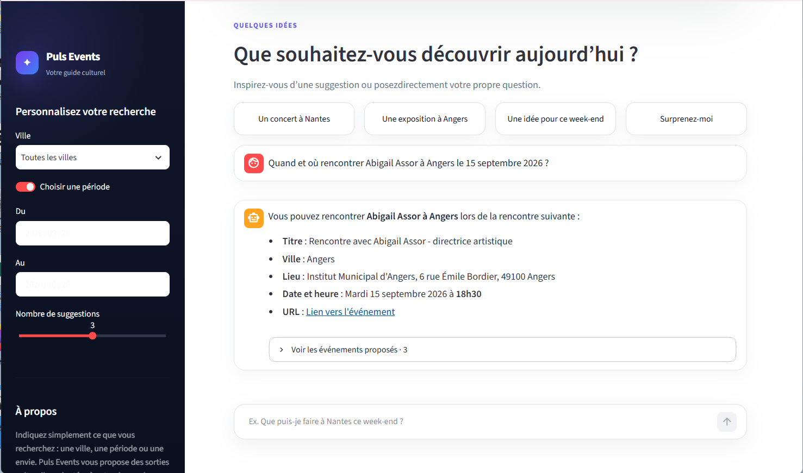
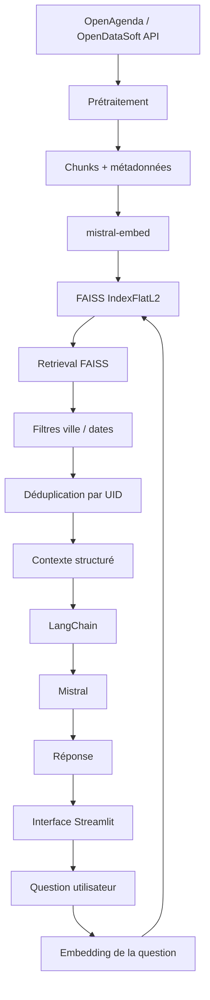

# Puls-Events RAG

**Assistant RAG de découverte et de recommandation d’événements culturels à partir de données publiques OpenAgenda.**

Puls-Events combine **ingestion et préparation de données**, **recherche sémantique**, **filtres métier** et **génération augmentée par retrieval** pour répondre à des questions en langage naturel sur les événements culturels en Pays de la Loire.


**Stack :** Python 3.12, Pandas, LangChain, Mistral AI, FAISS, Streamlit, Docker, Pytest

**Snapshot évalué :** 12 763 événements uniques, 14 547 chunks, 25/25 cas exécutés, 74 tests automatisés

**Résultats clés :** MRR 0.9545, Faithfulness 0.9160, Answer Relevancy 0.8980, Context Precision 0.8620, Context Recall 0.7740

> **Version jury figée :** [`jury-v1.0.0`](https://github.com/Hassna-elbousiydy/Puls_Events_RAG/releases/tag/jury-v1.0.0)  commit `d8d0e1c`

---

## Démo

Exemple de question :

> **Quand et où rencontrer Abigail Assor à Angers le 15 septembre 2026 ?**

Le système identifie les événements pertinents, applique les contraintes disponibles, déduplique les résultats par UID et génère une réponse à partir du contexte récupéré.



---

## Objectifs du projet

Le POC devait permettre de :

- récupérer et nettoyer les données OpenAgenda ;
- limiter les données au périmètre géographique retenu ;
- conserver un historique récent d’un an ainsi que les événements futurs ;
- découper les contenus en chunks ;
- produire des embeddings avec Mistral ;
- construire un index vectoriel FAISS ;
- effectuer une recherche sémantique ;
- appliquer des filtres métier sur la ville et les dates ;
- générer une réponse à partir du contexte récupéré ;
- évaluer séparément le retrieval et la génération ;
- fournir un environnement reproductible avec Docker ;
- disposer de tests automatisés ;
- permettre une démonstration locale via une interface Streamlit.

---

## Résultats du POC

Le snapshot final utilisé pour l’évaluation contient :

| Élément | Résultat |
|---|---:|
| Événements uniques | 12 763 |
| Chunks indexés | 14 547 |
| Cas d’évaluation | 25 / 25 |
| Tests automatisés | 74 passed |
| UID Recall | 1.0000 |
| MRR | 0.9545 |
| Faithfulness | 0.9160 |
| Answer Relevancy | 0.8980 |
| Context Precision | 0.8620 |
| Context Recall | 0.7740 |

Date de référence du snapshot final :

```text
2026-09-21
```

---

## Architecture



Le pipeline est séparé en deux parties :

### Indexation

```text
OpenAgenda
    ↓
Prétraitement
    ↓
Chunking
    ↓
mistral-embed
    ↓
FAISS
```

### Question utilisateur

```text
Question
    ↓
Embedding
    ↓
FAISS
    ↓
Filtres métier
    ↓
Déduplication UID
    ↓
Contexte
    ↓
LangChain
    ↓
Mistral
    ↓
Réponse
```

L’historique conversationnel n’est pas requis dans le périmètre du POC. Chaque question peut être traitée indépendamment.

---

## Technologies utilisées

- Python 3.12
- Pandas
- LangChain
- Mistral AI
- `mistral-embed`
- FAISS CPU
- Streamlit
- Pytest
- Docker
- Git

Le modèle utilisé pour les embeddings est :

```text
mistral-embed
```

Dimension des vecteurs :

```text
1024
```

Le modèle de génération utilisé dans le POC est :

```text
ministral-8b-2512
```

---

## Prérequis

Environnement recommandé :

- Python 3.12 ;
- Docker Desktop ;
- Git ;
- une clé API Mistral valide.

Cloner le projet :

```powershell
git clone https://github.com/Hassna-elbousiydy/Puls_Events_RAG.git
cd Puls_Events_RAG
```

Créer ensuite le fichier `.env` à partir de `.env.example` :

```powershell
Copy-Item .env.example .env
```

Renseigner localement :

```text
MISTRAL_API_KEY=...
MISTRAL_CHAT_MODEL=ministral-8b-2512
```

La clé API ne doit jamais être versionnée dans Git.

---

## Gestion des dépendances

Les dépendances principales sont définies dans :

```text
requirements.txt
```

Une version figée de l’environnement est également disponible dans :

```text
requirements-lock.txt
```

Construction de l’image Docker :

```powershell
docker compose build
```

Vérification des dépendances :

```powershell
docker compose run --rm rag python -m pip check
```

Vérification de l’environnement :

```powershell
docker compose run --rm rag python scripts/check_environment.py
```

---

## Structure principale du projet

| Chemin | Rôle |
|---|---|
| `app.py` | Interface Streamlit locale |
| `assets/styles.css` | Styles de l’interface |
| `.streamlit/config.toml` | Configuration Streamlit |
| `scripts/fetch_openagenda.py` | Acquisition des événements |
| `scripts/preprocess_openagenda.py` | Nettoyage et filtrage |
| `scripts/build_chunks.py` | Construction des chunks |
| `scripts/build_vectorstore.py` | Embeddings et création de l’index FAISS |
| `scripts/rebuild_pipeline.py` | Reconstruction complète du pipeline |
| `scripts/refresh_snapshot.py` | Rafraîchissement temporel du snapshot |
| `scripts/demo.py` | Démonstration en ligne de commande |
| `scripts/evaluate_rag.py` | Évaluation du RAG |
| `scripts/review_rag_evaluation.py` | Validation humaine des références |
| `src/rag/retrieval.py` | Retrieval FAISS et filtres |
| `src/rag/pipeline.py` | Pipeline RAG et génération |
| `src/rag/config.py` | Configuration |
| `src/rag/evaluation.py` | Évaluation sémantique |
| `data/evaluation/` | Benchmark de 25 questions-réponses |
| `tests/` | Tests automatisés |
| `reports/final/` | Preuves finales des tests et de l’évaluation |
| `docs/` | Documentation du projet |

Le vectorstore FAISS n’a pas besoin d’être versionné dans Git : il peut être reconstruit à partir des scripts fournis.

---

## Interface locale

Une interface Streamlit permet d’utiliser le POC directement depuis le navigateur.

Elle permet notamment :

- de poser une question en langage naturel ;
- de sélectionner éventuellement une ville ;
- de sélectionner éventuellement une période ;
- de choisir le nombre de suggestions ;
- de consulter les événements proposés ;
- d’accéder à leur source OpenAgenda.

Lancement :

```powershell
docker compose run --rm -p 8501:8501 -e PULS_REFERENCE_DATE=2026-09-21 rag streamlit run app.py --server.address=0.0.0.0 --server.port=8501
```

Puis ouvrir :

```text
http://localhost:8501
```

Exemple de question utilisée pendant la démonstration :

```text
Quand et où rencontrer Abigail Assor à Angers le 15 septembre 2026 ?
```

Pour ce cas, l’événement de référence possède l’UID :

```text
60424656
```

et est retrouvé au rang 1.

---

## Source des données

Le projet utilise le dataset public :

**Événements publics OpenAgenda**

Source :

```text
https://public.opendatasoft.com/explore/dataset/evenements-publics-openagenda/
```

L’acquisition automatisée utilise l’API publique OpenDataSoft Explore v2.1 exposant les données OpenAgenda.

Le périmètre retenu est :

```text
Pays de la Loire
```

Le premier export étudié contenait :

```text
24 601 lignes
56 colonnes
```

---

## Acquisition

Exemple :

```powershell
docker compose run --rm rag python scripts/fetch_openagenda.py --reference-date 2026-09-21
```

Cette étape permet de récupérer un snapshot exploitable et reproductible des données.

---

## Prétraitement

Commande :

```powershell
docker compose run --rm rag python scripts/preprocess_openagenda.py --reference-date 2026-09-21
```

Le prétraitement réalise notamment :

- le filtrage sur la région Pays de la Loire ;
- le contrôle des dates ;
- la conservation d’un historique récent d’un an ;
- la conservation des événements futurs ;
- l’exclusion des événements annulés ;
- le contrôle des champs essentiels ;
- le filtrage du périmètre culturel ;
- la déduplication par UID ;
- la normalisation des informations géographiques ;
- la préparation des informations temporelles structurées.

### Règle temporelle

Pour une date de référence donnée, le système conserve :

- les événements encore compris dans la période historique d’un an ;
- les événements présents ;
- les événements futurs disponibles dans le snapshot.

Les créneaux temporels structurés sont utilisés en priorité lorsqu’ils sont disponibles.

---

## Chunking

Les contenus sont découpés avec :

```text
RecursiveCharacterTextSplitter
```

Paramètres :

```text
chunk_size = 1500
chunk_overlap = 200
```

L’overlap réduit le risque de perdre une information située à la frontière entre deux chunks.

Chaque chunk conserve les principales métadonnées de l’événement :

- UID ;
- titre ;
- ville ;
- région ;
- lieu ;
- dates ;
- URL ;
- créneaux temporels.

---

## Embeddings

Les chunks sont transformés en vecteurs avec :

```text
mistral-embed
```

Dimension :

```text
1024
```

La question utilisateur est vectorisée avec le même modèle afin de pouvoir comparer sa proximité sémantique avec les contenus indexés.

---

## FAISS

Le vectorstore utilise :

```text
FAISS CPU
IndexFlatL2
```

`IndexFlatL2` réalise une recherche exacte par distance euclidienne L2.

Ce choix est adapté au POC car :

- le volume reste raisonnable ;
- la recherche est exacte ;
- aucune infrastructure vectorielle externe n’est nécessaire ;
- le système peut fonctionner localement ;
- la configuration reste simple et reproductible.

Pour un volume beaucoup plus important, d’autres options pourraient être étudiées :

- FAISS IVF ;
- HNSW ;
- Milvus ;
- Weaviate ;
- Pinecone.

---

## Snapshot final

Date de référence :

```text
2026-09-21
```

Le snapshot final contient :

```text
12 763 événements uniques
14 547 chunks
```

Lors du dernier refresh :

```text
549 événements expirés ont été retirés
```

Les embeddings des chunks inchangés ont été réutilisés.

Aucun nouvel appel d’embedding n’a été nécessaire pour ce refresh.

---

## Reconstruction complète

Pour reconstruire le pipeline :

```powershell
docker compose run --rm rag python -m scripts.rebuild_pipeline --reference-date 2026-09-21
```

La reconstruction couvre :

1. acquisition ;
2. prétraitement ;
3. chunking ;
4. embeddings ;
5. création de l’index FAISS ;
6. tests ;
7. activation des artefacts produits.

---

## Refresh temporel

Pour mettre à jour la fenêtre temporelle sans recalculer inutilement les embeddings :

```powershell
docker compose run --rm rag python -m scripts.refresh_snapshot --output refreshed_snapshot --reference-date 2026-09-21
```

Les événements devenus trop anciens sont retirés tandis que les vecteurs encore valides peuvent être réutilisés.

---

## Retrieval

Le retrieval est implémenté dans :

```text
src/rag/retrieval.py
```

Il réalise notamment :

1. l’embedding de la question ;
2. la recherche dans FAISS ;
3. l’application éventuelle de filtres structurés ;
4. le regroupement des chunks par UID ;
5. la déduplication des événements ;
6. le classement des résultats ;
7. la construction du contexte transmis au modèle.

Les filtres structurés disponibles comprennent notamment :

- ville ;
- date de début ;
- date de fin.

Ces filtres complètent la recherche sémantique.

---

## Génération RAG

Le pipeline principal se trouve dans :

```text
src/rag/pipeline.py
```

La génération suit la chaîne :

```text
Question
    ↓
Embedding
    ↓
FAISS
    ↓
Événements pertinents
    ↓
Contexte
    ↓
Prompt LangChain
    ↓
Mistral
    ↓
Réponse
```

Le prompt impose notamment de :

- s’appuyer sur le contexte fourni ;
- ne pas inventer d’événement ;
- ne pas inventer de date ;
- ne pas inventer de lieu ;
- ne pas inventer d’URL ;
- répondre en français ;
- signaler un contexte insuffisant ;
- demander une précision lorsque la requête est ambiguë.

La génération utilise :

```text
temperature = 0
```

afin de réduire la variabilité.

---

## Démonstration en ligne de commande

Exemple avec ville et date :

```powershell
docker compose run --rm rag python -m scripts.demo "Quand et où rencontrer Abigail Assor à Angers le 15 septembre 2026 ?" --city Angers --start-date 2026-09-15 --end-date 2026-09-15
```

Autre exemple :

```powershell
docker compose run --rm rag python -m scripts.demo "Où voir Plants and People à Nantes ?" --city Nantes
```

La démonstration permet de voir les événements récupérés avant la génération de la réponse.

---

## Jeu d’évaluation

Le benchmark final contient :

```text
25 questions-réponses
```

Les références ont été revues humainement.

Fichier :

```text
data/evaluation/rag_evaluation.jsonl
```

Le jeu de référence peut contenir :

- la question ;
- une réponse de référence ;
- un ou plusieurs UID attendus ;
- une ville ;
- une contrainte temporelle ;
- des informations utilisées pendant la validation humaine.

---

## Évaluation du retrieval

Trois métriques principales sont utilisées.

### UID Precision

Part des résultats retournés correspondant aux UID attendus.

### UID Recall

Part des UID attendus effectivement retrouvés.

### MRR

Le Mean Reciprocal Rank mesure la position du premier résultat attendu.

Par exemple :

```text
rang 1 → 1.0
rang 2 → 0.5
rang 4 → 0.25
```

---

## Évaluation de la génération

Quatre axes sont évalués :

- `faithfulness` ;
- `answer_relevancy` ;
- `context_precision` ;
- `context_recall`.

Ces axes sont évalués par un juge Mistral utilisant une grille explicite.

Ils sont inspirés de métriques classiques d’évaluation RAG mais ne correspondent pas à une exécution directe de la librairie Ragas.

Le jugement du LLM est interprété conjointement avec les métriques déterministes et la validation humaine.

---

## Résultats finaux

Rapport d’évaluation final :

```text
reports/final/rag_evaluation_final_20260922.json
```

État :

```text
25 / 25 cas exécutés
25 / 25 réponses générées
25 / 25 cas jugés
status = completed
```

### Retrieval

| Métrique | Score |
|---|---:|
| UID Precision | 0.2212 |
| UID Recall | **1.0000** |
| MRR | **0.9545** |

Le rappel UID à `1.0000` signifie que tous les UID de référence concernés par cette métrique ont été retrouvés.

Le MRR de `0.9545` indique que le résultat attendu apparaît généralement très haut dans le classement.

La précision UID de `0.2212` est plus faible car le retriever retourne plusieurs candidats alors que la ground truth n’attend souvent qu’un nombre limité d’événements.

Elle ne doit donc pas être interprétée comme un taux global de réponses correctes.

### Génération et contexte

| Métrique | Score |
|---|---:|
| Faithfulness | **0.9160** |
| Answer Relevancy | **0.8980** |
| Context Precision | **0.8620** |
| Context Recall | **0.7740** |

Le principal axe d’amélioration reste la couverture du contexte utile.

---

## Qualité de la ground truth

Le cas `q08` a montré l’importance de vérifier la qualité du benchmark.

La formulation initiale pouvait correspondre à plusieurs occurrences de :

```text
Cartophote / La Traversée Photographique
```

La question a été précisée avec la date :

```text
17 septembre 2026
```

et la ground truth a été revérifiée.

Après correction :

```text
UID attendu : 90151893
UID rank     : 1
UID recall   : 1.0
MRR          : 1.0
```

Cet exemple montre qu’une référence ambiguë peut faire croire à tort que le système RAG est défaillant.

---

## Tests automatisés

Commande finale :

```powershell
docker compose run --rm -e PULS_REFERENCE_DATE=2026-09-21 rag pytest -q
```

Résultat :

```text
74 passed, 1 warning
```

Les tests couvrent notamment :

- le prétraitement ;
- les règles temporelles ;
- le périmètre géographique ;
- le chunking ;
- le vectorstore ;
- FAISS ;
- le retrieval ;
- la reconstruction du contexte ;
- les métriques d’évaluation ;
- les artefacts du pipeline.

Le warning restant n’est pas bloquant pour le fonctionnement du POC.

---

## Reproductibilité

La date de référence est explicitement fournie dans les commandes de validation :

```text
PULS_REFERENCE_DATE=2026-09-21
```

Cela évite que les résultats des tests changent uniquement parce que la date courante avance.

Le projet utilise Docker afin de stabiliser l’environnement d’exécution et les dépendances.

---

## Limites actuelles

Le projet reste un POC.

Principales limites :

- absence de mémoire conversationnelle ;
- extraction automatique de la ville et de la période encore limitée ;
- dépendance à l’API Mistral et à ses quotas ;
- dépendance à la qualité des données OpenAgenda ;
- certaines informations peuvent être absentes dans la source ;
- filtre culturel reposant en partie sur des règles métier ;
- `IndexFlatL2` n’est pas adapté à des volumes massifs ;
- variabilité résiduelle du LLM ;
- variabilité du LLM utilisé comme juge ;
- interface Streamlit disponible localement mais pas encore déployée publiquement ;
- absence de haute disponibilité ;
- absence de monitoring de production ;
- refresh et reconstruction non encore planifiés automatiquement.

---

## Passage en production

Pour passer du POC à une version de production, les étapes principales seraient :

1. automatiser l’acquisition OpenAgenda et le refresh ;
2. conserver et versionner les snapshots ;
3. déployer l’interface et sécuriser les secrets ;
4. extraire automatiquement ville, période et catégorie depuis les questions ;
5. mettre en place des logs structurés ;
6. superviser les erreurs API et la disponibilité ;
7. suivre la latence retrieval et génération ;
8. surveiller les coûts et les tokens ;
9. collecter le feedback utilisateur ;
10. enrichir régulièrement le benchmark ;
11. automatiser les tests de non-régression ;
12. suivre les dérives des données et des performances ;
13. faire évoluer l’index vectoriel si le volume augmente fortement.

---

## Sécurité

Les secrets ne doivent jamais être versionnés.

Le fichier :

```text
.env
```

reste local.

Le dépôt contient uniquement :

```text
.env.example
```

sans clé API réelle.

---

## Preuves finales

Les preuves produites lors de la validation finale se trouvent dans :

```text
reports/final/
```

Elles comprennent notamment :

```text
rag_evaluation_final_20260922.json
pytest_final_20260922.txt
```

Ces fichiers permettent de conserver une trace de l’évaluation finale et des tests exécutés.

---

## Livrables associés

Le projet fournit :

- le code du système RAG ;
- les scripts d’acquisition et de preprocessing ;
- les scripts de vectorisation et de gestion de l’index ;
- les tests automatisés ;
- le fichier de gestion des dépendances ;
- le benchmark de 25 questions-réponses ;
- les preuves d’évaluation ;
- le README de reproduction ;
- l’interface Streamlit locale.

Le rapport technique et la présentation de soutenance sont fournis séparément dans les livrables OpenClassrooms.

---

## État final

| Composant | État |
|---|---|
| Acquisition | ✅ |
| Prétraitement | ✅ |
| Chunking | ✅ |
| Embeddings Mistral | ✅ |
| FAISS | ✅ |
| Retrieval | ✅ |
| Génération Mistral | ✅ |
| Interface Streamlit | ✅ |
| Benchmark humain | ✅ 25 / 25 |
| Évaluation | ✅ 25 / 25 |
| Tests | ✅ 74 passed |

Le POC est fonctionnel, testé et reproductible.

---

## Autrice

**Hassna EL-BOUSIYDY**

Projet réalisé dans le cadre de la formation **Data Engineer OpenClassrooms**.